## Setting up jenkins

First we need to create a new ssh key pair, these will be used when authenticating with jenkins.

Go to the repo and go to settings and select deploy keys. Paste in public key and make sure to give write access

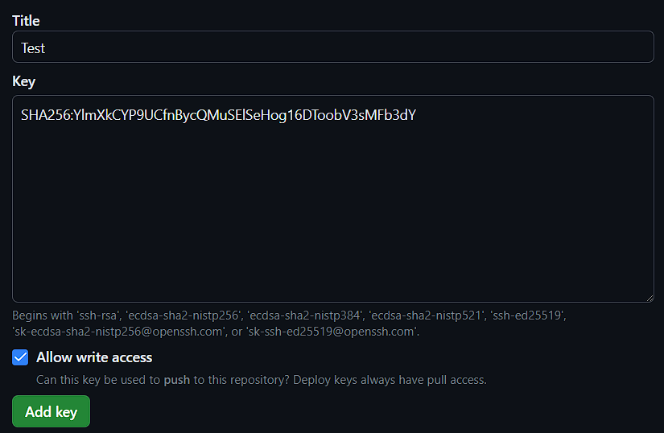

Go to jenkins and create a new item and choose freestyle project:

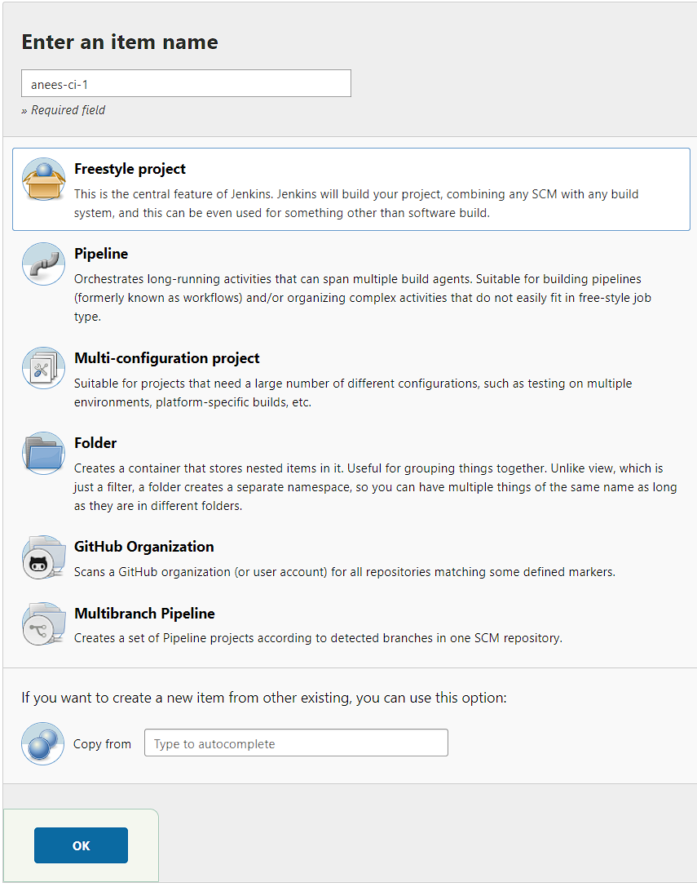

 Go back to github and copy http of repo and select github project and paste it in there

 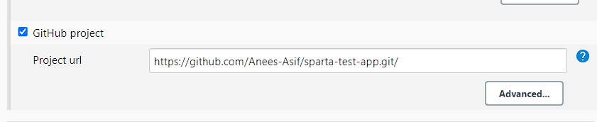

In office 365 connector select Restrict where this project can be run and enter sparta-ubuntu-node. This makes it so all tests run on test node.

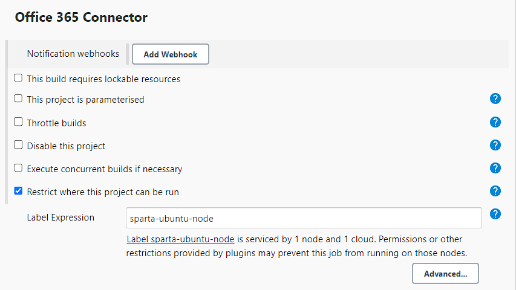

Next for source code management select git and paste in ssh url of the repo. Select the ssh private key dropdown and give a username that will help you identify in the future and paste in the private key.

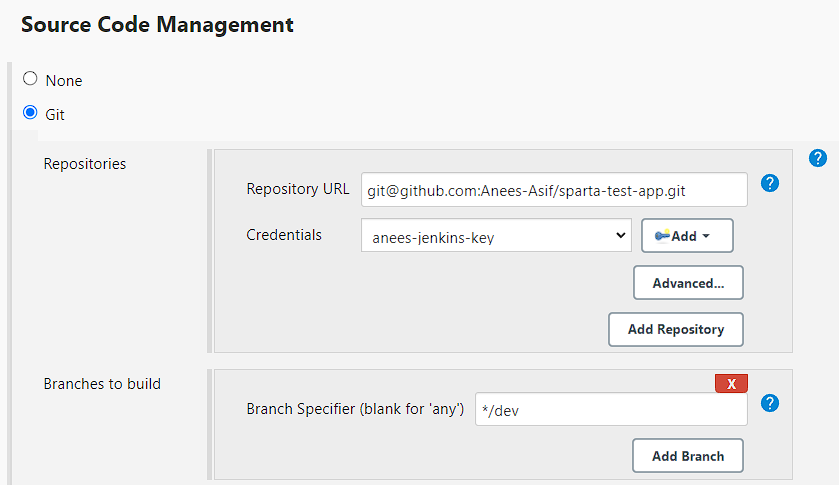

Make sure to select  **github hook trigger** in build triggers 

Choose **provide node** in build environment and select SSH agent and select tech254.pem

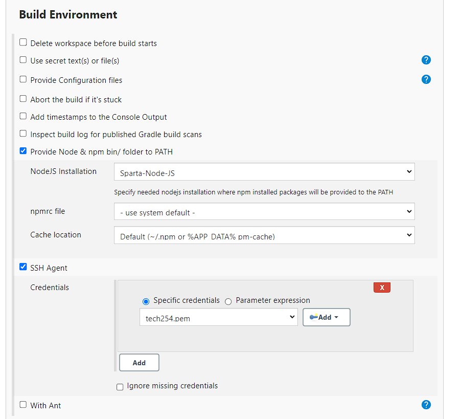

Finally go to build and press execute shell. Enter the following commands, this will run the test

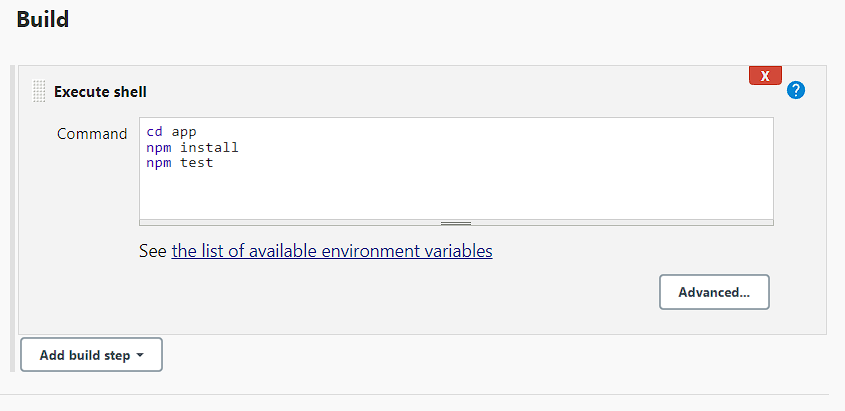

Setting up a webhook to listen. Each time we push, a test will be run.

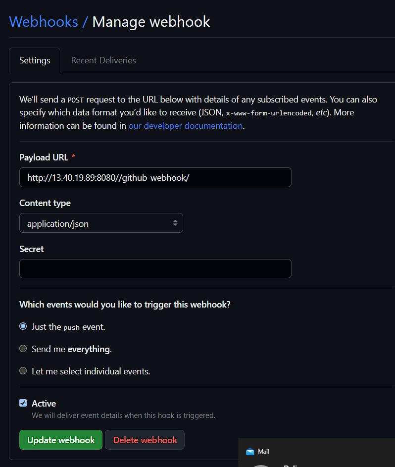

### Merge to main

Copy the template for the one we have created above, and we have to make a few changes.

In source code management, select add additional behaviors and scroll down to merge before build. After a successful test we will want this job to run.

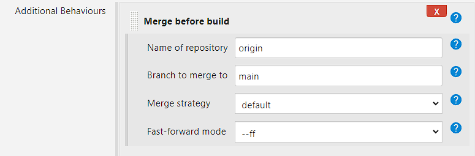

In build triggers select build after other projects are built, this will run our merge job after the test job has completed.

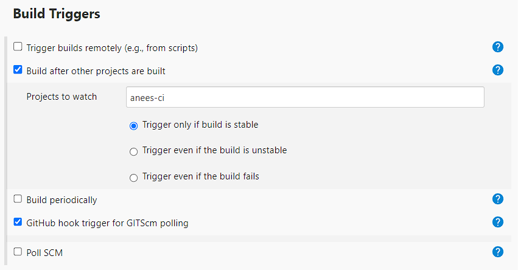

Make sure to remove the shell script as we don't need it on this job. Add git publisher and select merge result.

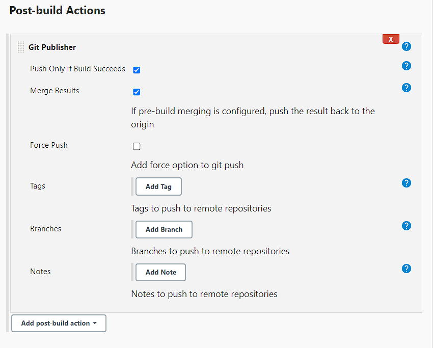

### Launching to AWS

